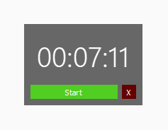

# Time Tracker (Tracker) Release 1.0.0

A Time tracker application written in Python3 and PySide2. This program logs time consumed by day in a DB and for configuration it has a settings file. It saves these files in the current working directory which means you will have multiple configurations or time tracking records depending on what directory you are working in. For me these directories are projects that I am working on using this I can track how much time has been consumed without having to go into the hassle of buying 3rd party software or record time using a stopwatch.

### User interface



**This user interface is completely customizable through the settings.json being created in every directory or project*

### Setup and Installation

Binaries are available for Windows 10 and onwards in the output folder, but the source is available and you can use it to build for your platform where PySide2 and Qt is available in this way all major platforms supporting Python3 and Qt framework are supported. 

### Usage

It is best to add the main directory of this program as path on your machine and use it through the terminal or IDE of your choice more efficient that way. For example, I always run this through the VS Code terminal and it works and feels like a built-in part of visual studio which is great.

### Source Setup

*Setting up source is very easy use the commands below*

```
install python3.9.5 on platform of your choice
```

*Clone this repository and go the directory and open terminal/cmd there*

```
python -m venv venv
```

```
venv\Scripts\activate.bat 
```

*Now as the environment will be activated use this to install all the packages needed*

```
pip install -r requirements.txt
```

*Once done to run it*

```
python main.py
```

### Known issues

As PySide6 is released you won't be able to set this up on latest versions of Python as PySide2 is incompatible with them, for that you can look into converting this application to PySide6 that won't be difficult, but I will add a branch later supporting PySide6 check if the branch is available or not then use that one instead of main.

### Configuration files and Records

There is one configuration file and that is the settings.json file. It's basic structure looks like this. The parameters are very self explanatory, except "AIQ" that value sets the configuration for facial detection features and normally it is not used. The RGB values have three color values and RGBA values have three color values and one transparency value, you can use them to customize the widget any way you see fit. The Record is created in form of one db per project so you have unique db for logging time for each project that could be commited to repo recording how time you have spent on that particular project. In it, it has one table with date and time consumed in total in terms of seconds. *Simplicity is prefered here, and the things aren't overcomplicated, but they allow for other developers to make this project into something more serious. For me, this works perfectly.*

```
{
    "background": "rgba(100, 100, 100, 250)", 
    "color": "rgb(255, 255, 255)", 
    "size": 30, 
    "playbtn": "rgb(80, 206, 33)", 
    "playbtnHover": "rgb(80, 237, 37)", 
    "pausebtn": "rgb(216, 193, 17)", 
    "pausebtnHover": "rgb(237, 212, 23)", 
    "exitbtn": "rgb(100, 0, 0)", 
    "exitbtnHover": "rgb(170, 0, 0)", 
    "textColor": "rgb(255, 255, 255)", 
    "storename": "logging.db", 
    "textFamily": "Segoe UI Variable", 
    "AIQ": 9
}
```

### Experimental Features

As an *experimental feature* I've tested capabilities of this script to detect your face through your webcam to determine whether you are infront of the screen or not, if you are not in front of the screen the timer will be paused. I implemented this to avoid stopping every time I go away from my chair and this** *shouldn't be used to track employees working by employers***, ***I don't allow that. I respect everyone's right to privacy even during work***. 

Normally, these features are commented out but if you want to give it a go then you have to uncomment them first then pass --AI before starting to enable facial detection. But, in my honest opinion you will never use this as it is unpredictable and buggy.

### Contribution

*I would like to thank [logisstudio](https://www.flaticon.com/authors/logisstudio) for providing the icon used as the application icon, many thanks. If you want this to be removed, add an issue on this repo and this will be removed from the applicaton.  Also any grammatical errors are also encourgaged to be reported, the english langauge is not my first so, errors are expected.*

#### Dated: 28-Feb-2023
